# Backend_Test

## 📖 목차 
1. [Django, jwt 기본 이해](#Django, jwt 기본 이해) 
2. [유닛 테스트](#유닛_테스트) 
3. [PR 날려보기](PR_날려보기)
6. [도커를 통한 ec2 배포](#도커를_통한_ec2_배포)
7. [ai_code_rewiew_Refactoring](#Refactoring)

-------
## Django, jwt 기본 이해

- [x]  Middleware란 무엇인가? (with Decorators)

미들웨어는 Django의 요청/응답 처리를 위한 중간 처리 로직이다 .

주요 사용 사례는 사용자 권한 확인, 에러 처리, CORS 관리가 있다.

특징으로는   

전역적 범위: 모든 요청에 대해 실행
실행 순서가 정해져 있음 (settings 의 순서대로)
request/response 사이클 전체에 영향
주로 인증, 보안, 세션 관리 등 전역적 기능에 사용한다.

데코레이터는 미들웨어와 다르게 특정 뷰만 사용하고 개별 뷰에 직접 적용, 뷰가 실행될때 전과 후로 작동한다.

- [x]  Django란?
Django는 Python으로 작성된 웹 프레임워크다.

MVT(Model-View-Template) 아키텍처 패턴을 따른다.

Model: 데이터베이스 구조와 데이터를 관리

View: 비즈니스 로직을 처리

Template: 사용자에게 보여지는 UI 부분을 담당

ORM(Object-Relational Mapping)을 제공하여 데이터베이스 조작을 Python 코드로 할수있다.

Django REST Framework(DRF)는 REST API를 쉽게 구축할 수 있게 해준다.

Serializer를 통한 데이터를 직렬화할 수 있다. 

Model 인스턴스나 쿼리셋을 JSON등으로 변환할 수 있다. 

ViewSet등을 통해 CRUD 작업을 쉽게 구현할수있다.

JWT 인증 방식 지원을 지원한다.

Swagger/OpenAPI를 통한 API 문서화를 할수있다.

이를 통해 빠른 백엔드 api를 만들 수 있다.

-----------

**JWT 기본 이해**

- [x]  JWT란 무엇인가요?
JSON Web Token은 정보를 JSON형태로 안전하게 전송하기 위한 표준이다.

디코딩하면 내용을 읽을 수 있는 특징이 있다.

이러한 이유로 보통 Access Token과 Refresh Token의 두 가지 토큰을 함께 사용한다.

-----------

**토큰 발행과 유효성 확인**

- [x]  Access / Refresh Token 발행과 검증에 관한 테스트 시나리오 작성하기

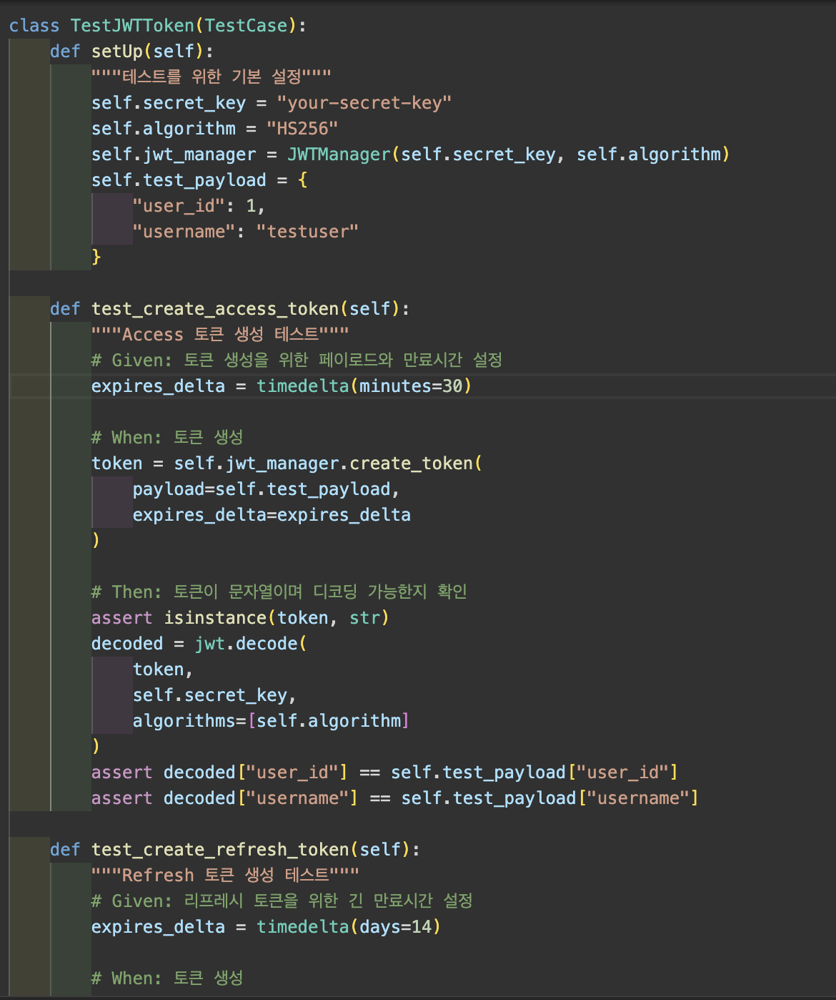

자세한 내용은 test.py 작성해 놓았습니다.

## 유닛 테스트
-----------
**유닛 테스트 작성**

- [x]  Pytest를 이용한 JWT Unit 테스트 코드 작성해보기
테스트 코드 확인
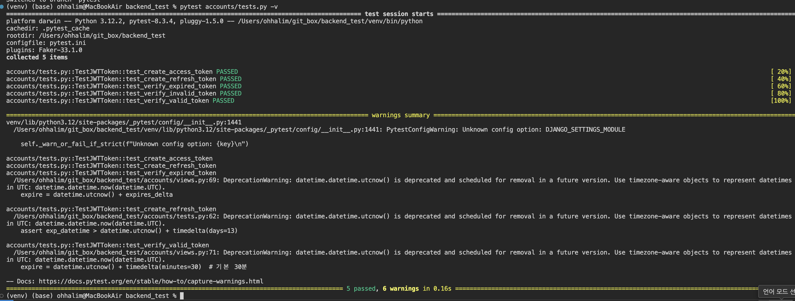

-----------
## PR 날려보기

- [x]  PR 날려보기

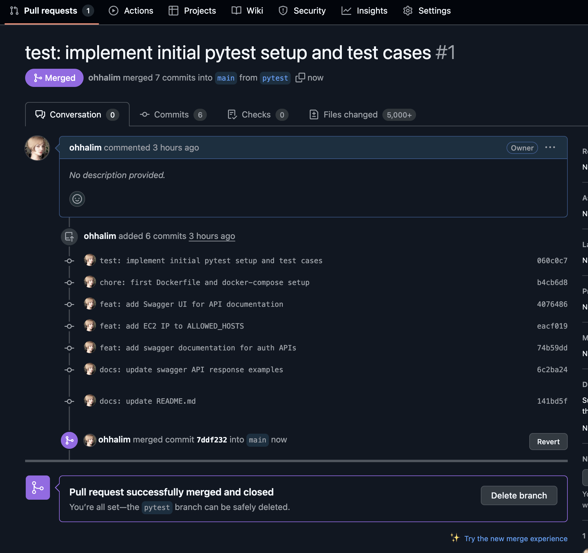

## 도커를 통한 ec2 배포

**테스트 완성**

- [ ]  백엔드 유닛 테스트 완성하기

포스트맨 확인
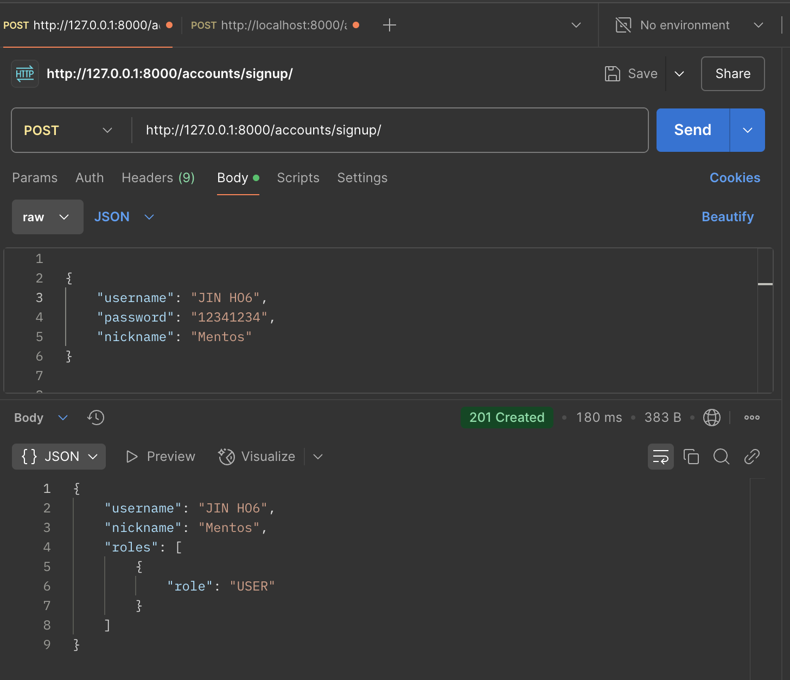
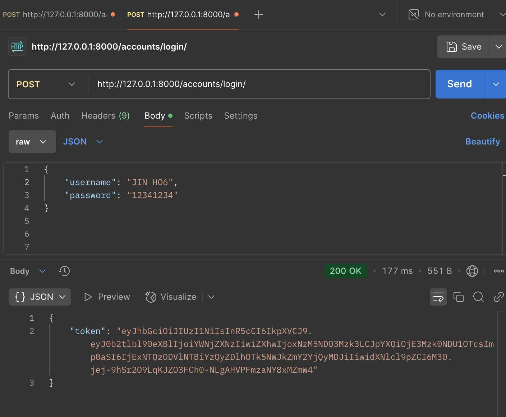

**로직 작성**

- [x] 회원가입 - /signup

- [x] 로그인 - /login

- [x]  EC2에 배포해보기

http://3.36.66.35:8000/swagger/ 

## 배포완료 테스트 GIF

**API 접근과 검증**

- [x]  Swagger UI로 접속 가능하게 하기

1. 서버 작동 테스트
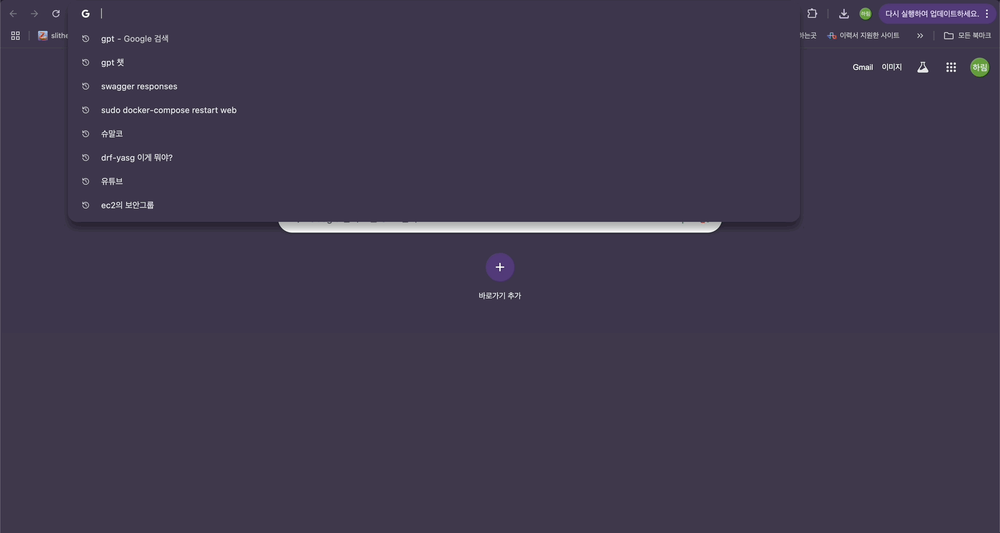

2. 회원가입 테스트
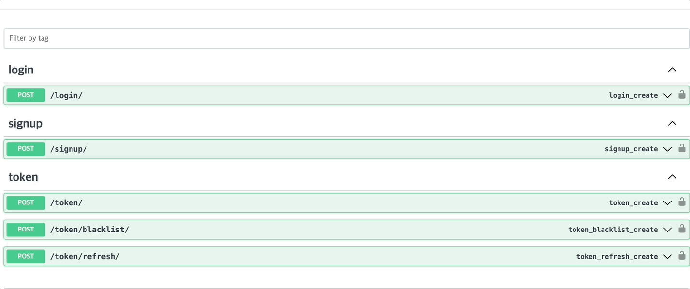

3. 로그인 테스트
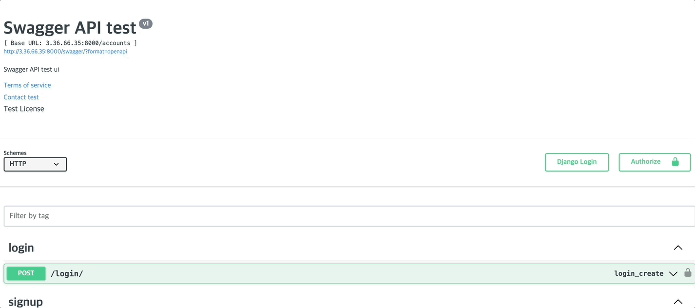

----------- 

## Refactoring

- [x] AI 피드백 리뷰 받아서 코드 개선하기

AI 리뷰 
models
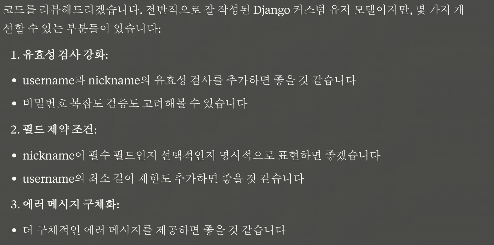
개선된 사항
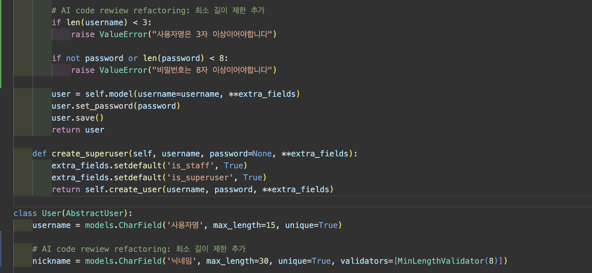

serializers
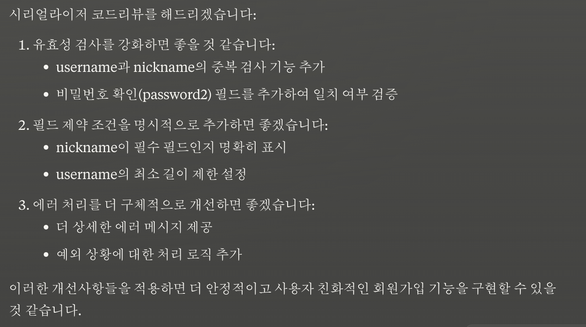
개선된 사항
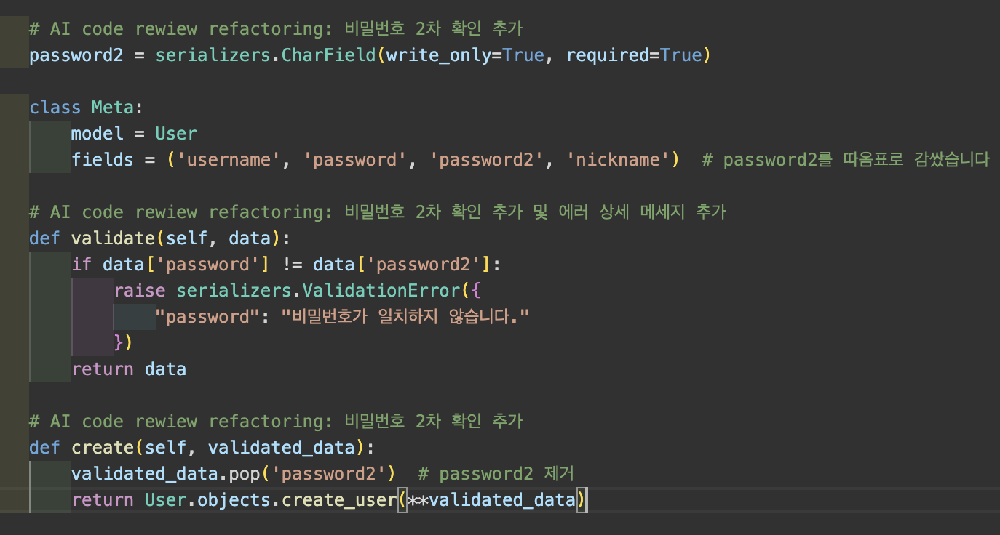

views
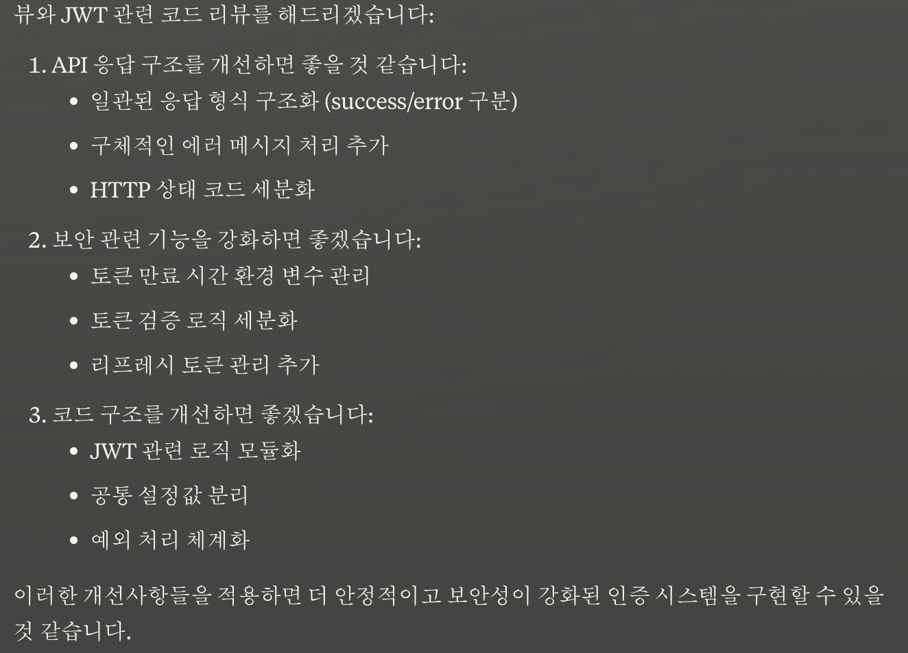
개선된 사항
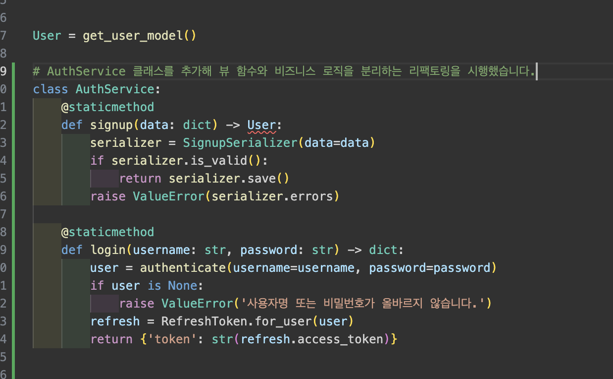

-----------
**마무리**

- [x]  AWS EC2 재배포하기
