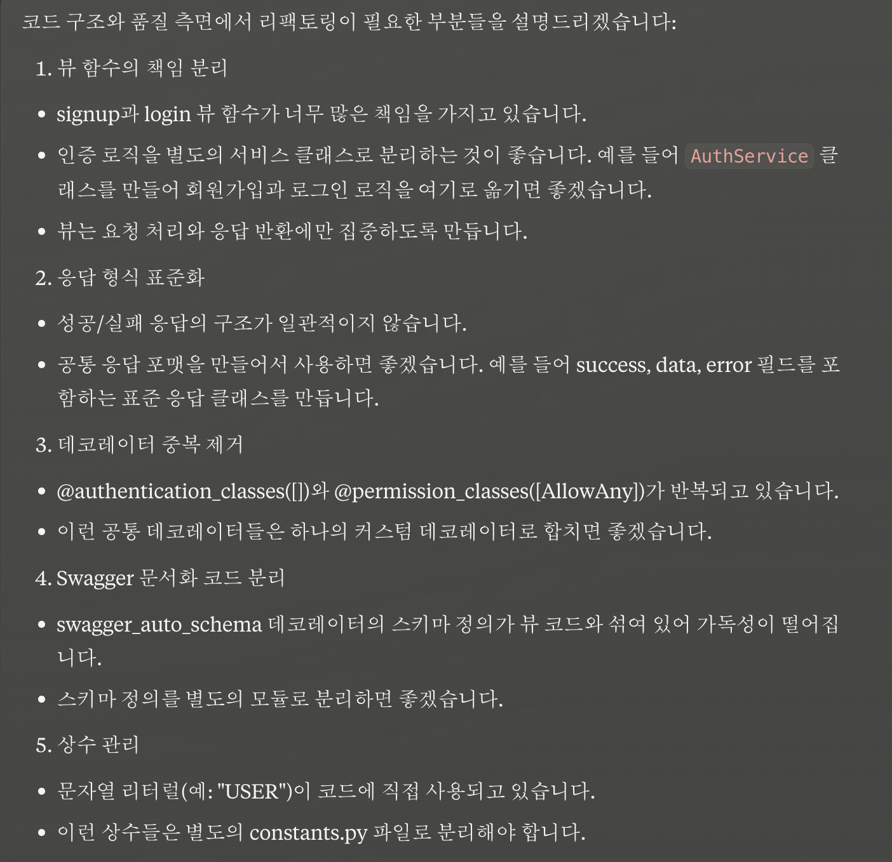

# Backend_Test

- [ ]  EC2에 배포해보기

http://3.36.66.35:8000/swagger/ 

## 배포완료 테스트 GIF

**API 접근과 검증**

- [ ]  Swagger UI로 접속 가능하게 하기

1. 서버 작동 테스트

2. 회원가입 테스트

3. 로그인 테스트

**Refactoring**

- [ ] AI 피드백 리뷰 받아서 코드 개선하기

AI 리뷰 
models

개선된 사항

serializers

개선된 사항

views

개선된 사항

**마무리**

- [ ]  AWS EC2 재배포하기

- [ ]  Pytest를 이용한 테스트 코드 작성법 이해

- [ ]  Django를 이용한 인증과 권한 이해

- [ ]  JWT와 구체적인 알고리즘의 이해

- [ ]  PR 날려보기
git 

