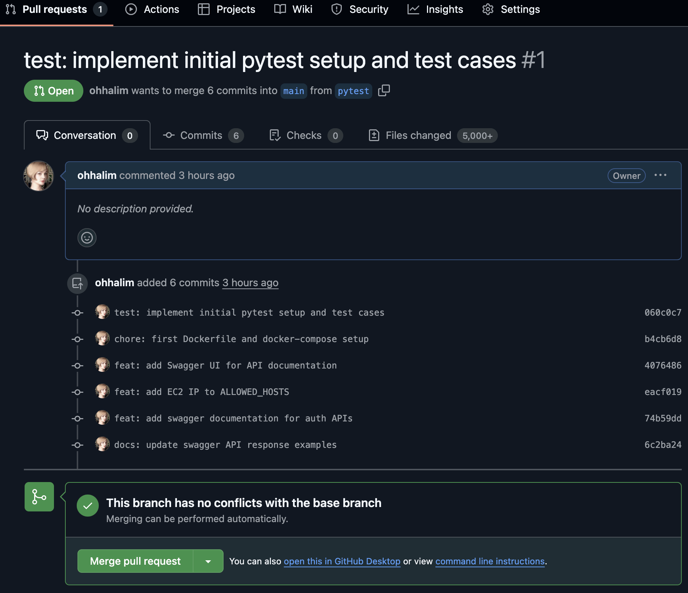

# Backend_Test

- [ ]  EC2에 배포해보기

http://3.36.66.35:8000/swagger/ 

## 배포완료 테스트 GIF

**API 접근과 검증**

- [ ]  Swagger UI로 접속 가능하게 하기

1. 서버 작동 테스트

2. 회원가입 테스트

3. 로그인 테스트

**Refactoring**

- [ ] AI 피드백 리뷰 받아서 코드 개선하기

AI 리뷰 
models

개선된 사항

serializers

개선된 사항

views

개선된 사항

**마무리**

- [ ]  AWS EC2 재배포하기

**Django기본 이해**

- [ ]  Middleware란 무엇인가? (with Decorators)
- [ ]  Django란?

**JWT 기본 이해**

- [ ]  JWT란 무엇인가요?

### 시나리오 설계 및 코딩 시작!

**토큰 발행과 유효성 확인**

- [ ]  Access / Refresh Token 발행과 검증에 관한 테스트 시나리오 작성하기

**유닛 테스트 작성**

- [ ]  Pytest를 이용한 JWT Unit 테스트 코드 작성해보기

**PR 날려보기**

- [ ]  PR 날려보기

### 백엔드 배포하기

**테스트 완성**

- [ ]  백엔드 유닛 테스트 완성하기

**로직 작성**

- [ ] 회원가입 - /signup

- [ ] 로그인 - /login